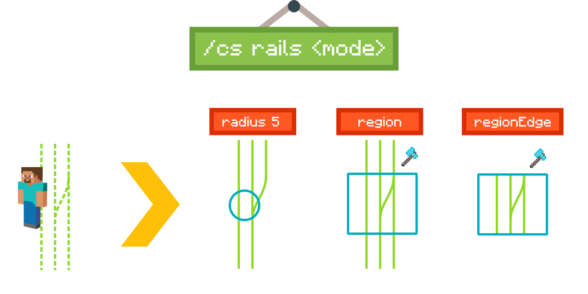
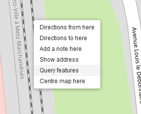
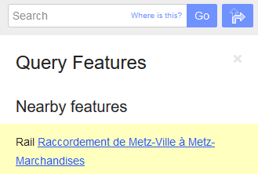
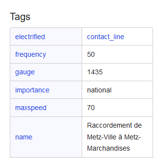

<br />
<p align="center">
  <a href="https://github.com/othneildrew/Best-README-Template">
    
  </a>

  <h1 align="center">BTE-tools</h1>

  <p align="center">
    Awesome tools and scripts to enhance your experience on the Build The Earth project!
    <br />
    <a href="https://buildtheearth.net/"><strong>Go to Build The Earth »</strong></a>
    <br />
    <br />
    <a href="https://github.com/oganexon/BTE-tools/issues">Report Bug</a>
    ·
    <a href="https://github.com/oganexon/BTE-tools/issues">Request Feature</a>
  </p>
</p>

> ℹ I'm looking for a maintainer. Contact me if interested

<details>
<summary>Details</summary>
<p>
You need a good knowledge of JavaScript, some experience with craftscript and an understanding of some parts of WorldEdit's Java code. 

If you only have some knowledge of javascript it can be enough if you understand quickly.

Contact me on Discord: Oganexon#2001
</p></details>


## Table of Contents

- [Table of Contents](#table-of-contents)
- [About The Project](#about-the-project)
  - [Built With](#built-with)
- [Getting Started](#getting-started)
  - [Prerequisites](#prerequisites)
- [Installation](#installation)
- [Usage](#usage)
  - [list / help](#list--help)
  - [tpll](#tpll)
  - [draw](#draw)
  - [rails](#rails)
  - [address](#address)
  - [ign](#ign)
  - [hedges](#hedges)
- [Find a railroad name](#find-a-railroad-name)
- [Roadmap](#roadmap)
- [Contributing](#contributing)
- [License](#license)
- [Contact](#contact)


## About The Project

✨ The BTE generation is not perfect and some structures such as railway lines are missing.
Doing it by hand is unthinkable given the curves and the number of measurements that would have to be taken. 
This set of tools will allow you to enjoy a better experience on BTE and build to your full potential.

### Built With

* [Node](https://nodejs.org/)

## Getting Started


### Prerequisites

You must have WorldEdit as a minimum but install the BTE modpack, it's preferable.

## Installation

1. Download the [Rhino Javacsript interpreter](https://developer.mozilla.org/en-US/docs/Mozilla/Projects/Rhino) for Java,
which you can get from [here](https://github.com/mozilla/rhino/releases/download/Rhino1_7_12_Release/rhino-1.7.12.zip).
Open the zip file, go to `/lib` and move `rhino-1.7.12.jar` (or newer) to your `mods` Minecraft folder.
(Usually `C:\Users\[USERNAME]\Twitch\Minecraft\Instances\Build The Earth modpack\mods` on Windows)

2. Download the latest version of BTE-scripts [here](https://github.com/oganexon/BTE-tools/releases) and place the `craftscripts` folder in `/config/worldedit`.

3. (Recommended) Change the value of `scripting-timeout` to `30000` or higher in `/config/worldedit`. (`3000` ms by default)


## Usage

```fix
/cs <COMMAND> [ARGS]
```

🚀 These are WorldEdit scripts, if blocks are modified you have access to `//undo`.

- **list** : Lists all available commands.
- **tpll** : Classic tpll command that also accepts `degrees minutes seconds`
- **draw** : Traces any imported shape of an OpenStreetMap query - railroads, roads, etc.
- **rails** : Traces all railroads in an area
- **address** : Get the closest address
- **ign** : Get better elevation data (only works in France)

Do you need another function? Request it [here](https://github.com/oganexon/BTE-tools/issues).

The first execution of a command will take longer than the others because the script has to be compiled.


### list / help

```fix
/cs list
/cs help
```


Lists all available commands.


### tpll

```fix
/cs tpll <latitude> <longitude> [altitude]
```


Classic tpll command that also accepts `degrees minutes seconds`
This modified version will take you to the highest block even if you've build already.
You don't need to remove the comma if there is one when you copy the coordinates.

Examples :

```fix
/cs tpll 47.58523 6.89725
/cs tpll 47.58523, 6.89725, 370
/cs tpll 47°35'6.32"N 6°53'50.06"E
/cs tpll 47°35'6.32"N, 6°53'50.06"E, 370
```


### draw

```
/cs draw <file> <block> [options]
```
Traces any imported shape of an OpenStreetMap query - railroads, roads, etc.

Flags :
 - **u** (up): Draws a block above

Setup :
 - Create a `drawings` folder inside `/config/worldedit`.
 - Get a geoJSON file of valid tracings / OR
 - Choose one of the following links:
   - [Rails - bounding box](http://overpass-turbo.eu/s/TwW) (Select the desired region using the map)
   - [Rails - name](http://overpass-turbo.eu/s/TwY) (Replace with a specific railroad name) [(find a railroad name)](#%f0%9f%94%8d-find-a-railroad-name)
 - Click `Run` > `Export` > `download/copy as GeoJSON`
 - Place the file in the `drawings` folder.

Examples :

```fix
/cs draw rails1 iron_block
/cs draw file3 stone u
```

### rails

```fix
/cs rails <mode> [...args] [flags]
```



Traces all railroads in an area

Modes:
 - **radius** Select rails in a radius `<radius> [flags]`
 - **region** Select rails in a region `[flags]`
 - **regionEdge** Select rails in a region and draw only in the defined region `[flags]`

Flags :
 - **u** (up): Draws a block above

Examples :

```fix
/cs rails radius 7
/cs rails radius 50 u
/cs rails region
/cs rails region u
/cs rails regionEdge
/cs rails regionEdge u
```


### address

```fix
/cs address
```


Get the closest address, for example:
```
Avenue de la Gare TGV, La Jonxion, Meroux, Meroux-Moval, Belfort, Territoire-de-Belfort, Bourgogne-Franche-Comté, France métropolitaine, 90400, France
```


### ign

```fix
/cs ign
```


Get better elevation data (only works in France)
If you get weird lines, just select a slightly different area.

Flags :
 - **w** (water): Keeps water


### hedges

```fix
/cs hedge <mode> [...args] [block] [height]
```

Traces all railroads in an area

Modes:
 - **radius** Select hedges in a radius `<radius> [block] [height]`
 - **region** Select hedges in a region `[block] [height]`
 - **regionEdge** Select hedges in a region and draw only in the defined region `[block] [height]`


Examples :

```fix
/cs hedges radius 7
/cs hedges radius 50 cobblestone 3
/cs hedges region
/cs hedges region cobblestone 3
/cs hedges regionEdge
/cs hedges regionEdge cobblestone 3
```


## Find a railroad name

🔍 To find a railway name, right click near the rails and click on `Query features`



Then, click on the desired rail



And finally, get the name.




## Roadmap

📜 See the [open issues](https://github.com/oganexon/BTE-tools/issues) and
[project boards](https://github.com/oganexon/BTE-tools/projects/) for a list of proposed features (and known issues). 


## Contributing

🏗️ Contributions are what make the open source community such an amazing place to be learn, inspire, and create. Any contributions you make are **greatly appreciated**.

1. Fork the Project
2. Create your Feature Branch (`git checkout -b feature/AmazingFeature`)
3. Commit your Changes (`git commit -m 'Add some AmazingFeature'`)
4. Make sure that `yarn build` and `yarn lint` do not generate errors
5. Push to the Branch (`git push origin feature/AmazingFeature`)
6. Open a Pull Request


## License

Distributed under the MIT License. See `LICENSE` for more information.

Icon library by [Icons8](https://icons8.com/).


## Contact

Oganexon#2001 - Discord
oganexon@protonmail.com
