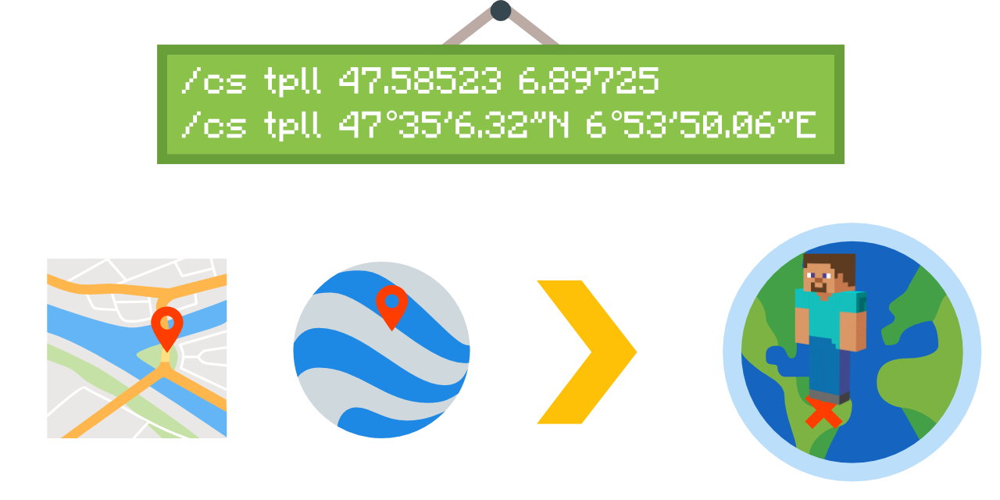
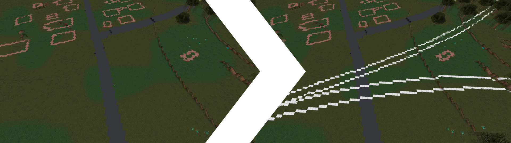
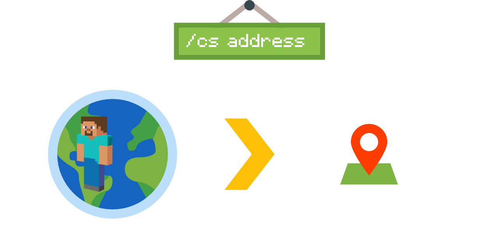
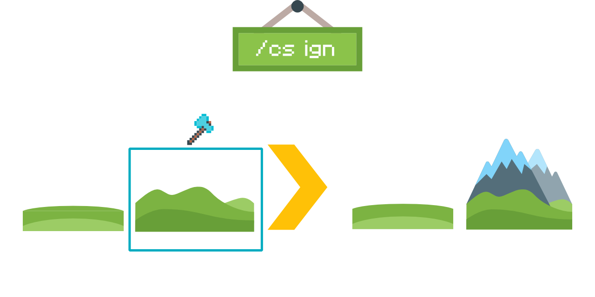
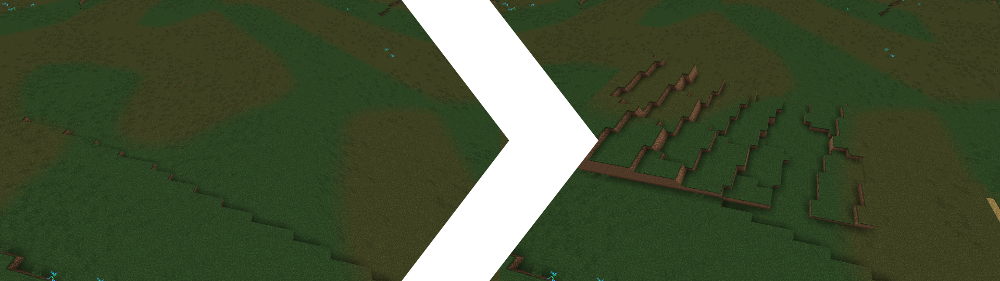
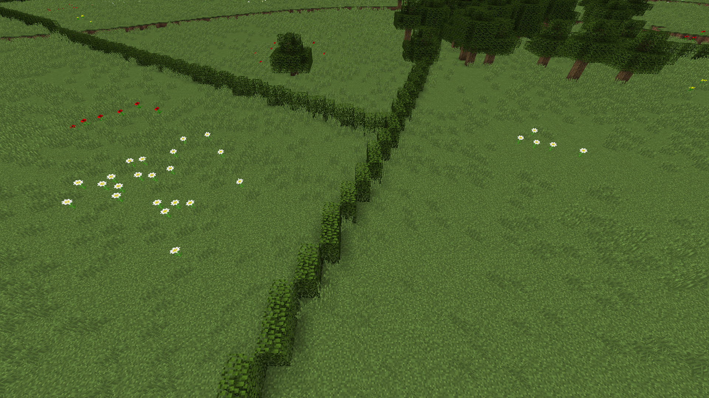

<br />
<p align="center">
  <a href="https://github.com/othneildrew/Best-README-Template">
    
  </a>

  <h1 align="center">BTE-tools</h1>

  <p align="center">
    Awesome tools and scripts to enhance your experience on the Build The Earth project!
    <br />
    <a href="https://buildtheearth.net/"><strong>Go to Build The Earth »</strong></a>
    <br />
    <br />
    <a href="https://github.com/oganexon/BTE-tools/issues">Report Bug</a>
    ·
    <a href="https://github.com/oganexon/BTE-tools/issues">Request Feature</a>
  </p>
</p>


## Table of Contents

- [Table of Contents](#table-of-contents)
- [🚩 Project status 🚩](#-project-status-)
- [About The Project](#about-the-project)
  - [Built With](#built-with)
- [Getting Started](#getting-started)
  - [Prerequisites](#prerequisites)
- [Installation](#installation)
- [Usage](#usage)
  - [help](#help)
  - [tpll](#tpll)
  - [draw](#draw)
  - [rails](#rails)
  - [railsnear](#railsnear)
  - [osm](#osm)
  - [osmnear](#osmnear)
  - [address](#address)
  - [gis](#gis)
  - [hedges](#hedges)
  - [hedgesnear](#hedgesnear)
  - [goto](#goto)
- [Default allowed & ignored blocks](#default-allowed--ignored-blocks)
- [Roadmap](#roadmap)
- [Contributing](#contributing)
- [License](#license)
- [Contact](#contact)

## 🚩 Project status 🚩

> 🚧**I'm looking for a maintainer. Contact me if interested**🚧
> 
> Feature requests are no longer accepted, only pull requests.

## About The Project

✨ The BTE generation is not perfect and some structures such as railway lines are missing.
Doing it by hand is unthinkable given the curves and the number of measurements that would have to be taken. 
This set of tools will allow you to enjoy a better experience on BTE and build to your full potential.

### Built With

* [Node](https://nodejs.org/)

## Getting Started


### Prerequisites

You must have WorldEdit as a minimum but install the BTE modpack, it's preferable.

## Installation

1. Download the [Rhino Javacsript interpreter](https://developer.mozilla.org/en-US/docs/Mozilla/Projects/Rhino) for Java,
which you can get from [here](https://github.com/mozilla/rhino/releases/download/Rhino1_7_12_Release/rhino-1.7.12.zip).
Open the zip file, go to `/lib` and move `rhino-1.7.12.jar` (or newer) to your `mods` Minecraft folder.
(Usually `C:\Users\[USERNAME]\Twitch\Minecraft\Instances\Build The Earth modpack\mods` on Windows)

2. Download the latest version of BTE-scripts [here](https://github.com/oganexon/BTE-tools/releases) and place the `craftscripts` folder in `/config/worldedit`.

3. (Recommended) Change the value of `scripting-timeout` to `30000` or higher in `/config/worldedit`. (`3000` ms by default)


## Usage

```fix
/cs <COMMAND> [ARGS]
```

🚀 These are WorldEdit scripts, if blocks are modified you have access to `//undo`.

- **help** : Lists all available commands.
- **tpll** : Classic tpll command that also accepts `degrees minutes seconds`
- **draw** : Traces any imported shape of an OpenStreetMap query - railroads, roads, etc.
- **rails** : Traces all railroads in an area
- **railsnear** : Traces all railroads around the player
- **address** : Get the closest address
- **hedges** : Traces all hedges in an area 
- **hedges** : Traces all hedges around the player
- **gis_fr** : Get better elevation data in France
- **gis_jp** : Get better elevation data in Japan
- **gis_no** : Get better elevation data in Norway
- **goto** : TP the player to a precise place

Do you need another function? Request it [here](https://github.com/oganexon/BTE-tools/issues).


### help

```sh
/cs help
```


Lists all available commands.


### tpll

```sh
/cs tpll <latitude> <longitude> [altitude]
```



Classic tpll command that also accepts `degrees minutes seconds`
This modified version will take you to the highest block even if you've build already.
You don't need to remove the comma if there is one when you copy the coordinates.

Examples :

```
/cs tpll 47.58523 6.89725
/cs tpll 47.58523, 6.89725, 370
/cs tpll 47°35'6.32"N 6°53'50.06"E
/cs tpll 47°35'6.32"N, 6°53'50.06"E, 370
```


### draw

```sh
/cs draw <file> [block] [options]
```
Traces any imported shape of an OpenStreetMap query - railroads, roads, etc.

Default options:
```json
{
  "block": "gold_block",
  "height": 1,
  "offset": 0,
  "onGround": true,
  "ignoreBuildings": true,
  "ignoreVegetation": true,
  "ignoredBlocks": ["see below"],
  "allowedBlocks": ["see below"]
}
```

Setup :
 - Create a `drawings` folder inside `/config/worldedit`.
 - Get a geoJSON/KML file of valid tracings / OR
 - Choose one of the following links:
   - [Rails - bounding box](http://overpass-turbo.eu/s/TwW) (Select the desired region using the map)
   - [Rails - name](http://overpass-turbo.eu/s/TwY) (Replace with a specific railroad name) [(find a railroad name)](#%f0%9f%94%8d-find-a-railroad-name)
 - Click `Run` > `Export` > `download/copy as GeoJSON`
 - Place the file in the `drawings` folder.

Examples :

```sh
/cs draw rails1 iron_block
/cs draw file3 stone {"height":5,"onGround":false}
```

### rails

```sh
/cs rails [options]
```

Traces all railroads in an area

Default options:

```json
{
  "block": "iron_block",
  "offset": 0,
  "height": 1,
  "regex": "^.*$",
  "onGround": true,
  "ignoreBuildings": true,
  "ignoreVegetation": true,
  "restrict": false,
  "ignoredBlocks": ["see below"],
  "allowedBlocks": ["see below"]
}
```

Examples :

```sh
/cs rails
/cs rails {"regex":"(subway|tram)"}
```



### railsnear

```sh
/cs railsnear <radius> [options]
```

Traces all railroads around the player

Default options:

```json
{
  "block": "iron_block",
  "offset": 0,
  "height": 1,
  "regex": "^.*$",
  "onGround": true,
  "ignoreBuildings": true,
  "ignoreVegetation": true,
  "restrict": false,
  "ignoredBlocks": ["see below"],
  "allowedBlocks": ["see below"]
}
```

Examples :

```sh
/cs railsnear 7
/cs railsnear 50 {"regex":"(subway|tram)"}
```

### osm

```sh
/cs osm <query> [options]
```

Run an overpass query in an area and trace the path

Default options:

```json
{
  "block": "diamond_block",
  "offset": 0,
  "height": 1,
  "onGround": true,
  "ignoreBuildings": true,
  "ignoreVegetation": true,
  "restrict": false,
  "ignoredBlocks": ["see below"],
  "allowedBlocks": ["see below"]
}
```

Examples :

```sh
/cs osm way[highway~"^.*$"]
/cs osm way[railway~"(subway|tram)"] {"block":"stone"}
```

### osmnear

```sh
/cs osmnear <query> <radius> [options]
```

Run an overpass query in an area and trace the path around the player

Default options:

```json
{
  "block": "diamond_block",
  "offset": 0,
  "height": 1,
  "onGround": true,
  "ignoreBuildings": true,
  "ignoreVegetation": true,
  "restrict": false,
  "ignoredBlocks": ["see below"],
  "allowedBlocks": ["see below"]
}
```

Examples :

```sh
/cs osmnear way[highway~"^.*$"] 7
/cs osmnear way[railway~"(subway|tram)"] 50 {"block":"stone"}
```


### address

```sh
/cs address
```



Get the closest address, for example:
```
Avenue de la Gare TGV, La Jonxion, Meroux, Meroux-Moval, Belfort, Territoire-de-Belfort, Bourgogne-Franche-Comté, France métropolitaine, 90400, France
```


### gis

```sh
/cs gis_fr [options]
/cs gis_jp [options]
/cs gis_no [options]
```



Get better elevation data in France, Japan, and Norway. For Norway, use a small work area.

Default options:
```json
{
  "smooth": true,
  "ignoreWater": false,
  "ignoredBlocks": ["see below"],
}
```

Examples:

```sh
/cs gis_fr
/cs gis_jp {"smooth":false,"ignoreWater":true}
/cs gis_no {"smooth":false}
```



### hedges

```sh
/cs hedges [options]
```

Traces all hedges in an area

Default options:
```json
{
  "block": "leaves:4",
  "height": 2,
  "offset": 1,
  "onGround": true,
  "ignoreBuildings": true,
  "ignoreVegetation": true,
  "restrict": false,
  "ignoredBlocks": ["see below"],
  "allowedBlocks": ["see below"]
}
```

Examples :

```sh
/cs hedges
/cs hedges {"block":"stone","height":3}
```



### hedgesnear

```sh
/cs hedgesnear <radius> [options]
```

Traces all hedges around the player

Default options:
```json
{
  "block": "leaves:4",
  "height": 2,
  "offset": 1,
  "onGround": true,
  "ignoreBuildings": true,
  "ignoreVegetation": true,
  "restrict": false,
  "ignoredBlocks": ["see below"],
  "allowedBlocks": ["see below"]
}
```

Examples :

```sh
/cs hedgesnear 7
/cs hedgesnear 50 {"block":"stone","height":3}
```


### goto

```sh
/cs goto <search query>
```

Examples :

```sh
/cs goto Paris
/cs goto Abidjan
/cs goto Area 51, USA
/cs goto Machu Picchu, Peru
```

## Default allowed & ignored blocks

The blocks ignored by default are used to not draw a path on the vegetation.
```js
[
  'air',
  'tallgrass',
  'sapling',
  'log',
  'log2',
  'leaves',
  'leaves2',
  'deadbush',
  'red_flower',
  'yellow_flower',
  'red_mushroom',
  'brown_mushroom',
  'vine',
  'waterlily',
  'cactus',
  'reeds',
  'pumpkin',
  'melon_block',
  'snow_layer',
  'double_plant'
]
```

The blocks allowed by default are used to not draw a path on existing buildings.
```js
[
  'air',
  'grass',
  'dirt',
  'stone',
  'sand',
  'grass_path',
  'concrete',
  'gravel',
  'water',
  'lava'
]
```


## Roadmap

📜 See the [open issues](https://github.com/oganexon/BTE-tools/issues) and
[project boards](https://github.com/oganexon/BTE-tools/projects/) for a list of proposed features (and known issues). 


## Contributing

🏗️ Contributions are what make the open source community such an amazing place to be learn, inspire, and create. Any contributions you make are **greatly appreciated**.

1. Fork the Project
2. Create your Feature Branch (`git checkout -b feature/AmazingFeature`)
3. Commit your Changes (`git commit -m 'Add some AmazingFeature'`)
4. Make sure that `yarn build` and `yarn lint` do not generate errors
5. Push to the Branch (`git push origin feature/AmazingFeature`)
6. Open a Pull Request


## License

Distributed under the MIT License. See `LICENSE` for more information.

Icon library by [Icons8](https://icons8.com/).


## Contact

Oganexon#2001 - Discord
oganexon@protonmail.com
